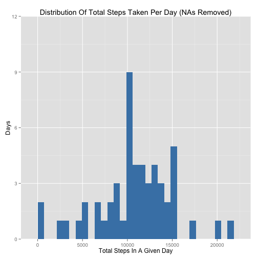
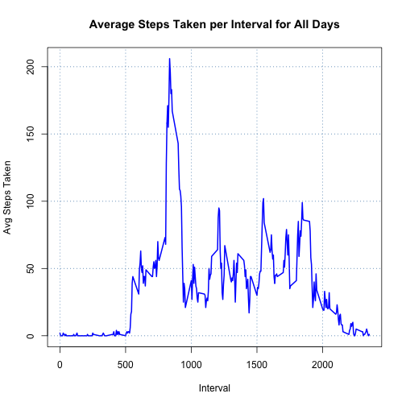
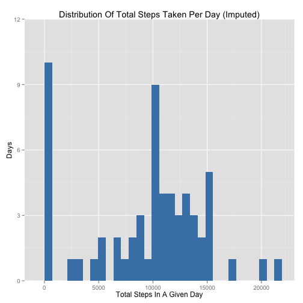
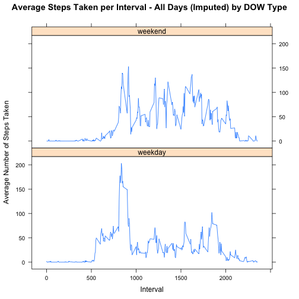

------------------------------------------------------------------------------

## Set up the environment:  

------------------------------------------------------------------------------

Load required libraries:  


```r
library(dplyr,     quietly = TRUE, warn.conflicts = FALSE)
library(ggplot2,   quietly = TRUE, warn.conflicts = FALSE)
library(lattice,   quietly = TRUE, warn.conflicts = FALSE)
library(lubridate, quietly = TRUE, warn.conflicts = FALSE)
```

------------------------------------------------------------------------------

## Loading and preprocessing the data:  

------------------------------------------------------------------------------

#### 1. Load the data:  

If the zip file exists, unzip it:  


```r
if (file.exists("activity.zip")) {
    unzip("activity.zip")
}
```

Read in the data:  


```r
acts <- read.csv("activity.csv", header = TRUE)
```

If the zip file still exists, remove the csv file:  


```r
if (file.exists("activity.zip")) {
    file.remove("activity.csv")
}
```

#### 2. Process/transform the data:  

Convert the fields:  


```r
acts$date  <- as.Date(acts$date)
acts$steps <- as.numeric(acts$steps)
```

------------------------------------------------------------------------------

## What is the mean total number of steps taken per day:  

------------------------------------------------------------------------------

#### 1. Calculate the total number of steps taken per day:  

Build a data frame with the date and total steps for that date:  


```r
stepsPerDay        <- aggregate(steps ~ date, acts, sum)
names(stepsPerDay) <- c("date", "total")
```

#### 2. Make a histogram of the total number of steps taken each day:  

Explicitly compute the binwidth:  


```r
rng <- range(stepsPerDay$total)
bw  <- (rng[2] - rng[1])/30
```

Build the histogram:  


```r
g <- ggplot(stepsPerDay, aes(x = total))
g <- g + 
     coord_cartesian(ylim = c(0, 12)) +
     labs(title = "Distribution Of Total Steps Taken Per Day (NAs Removed)") +
     labs(x = "Total Steps In A Given Day", y = "Days") +
     geom_histogram(fill = "steelBlue", binwidth = bw)
```

Plot it:  


```r
print(g)
```

 

#### 3. Calculate/report mean & median of total steps taken each day:  

Calculate the mean and median of the total steps taken each day:  


```r
meanSPD   <- round(mean(stepsPerDay$total), 0)
medianSPD <- round(median(stepsPerDay$total), 0)
```

Report them:  


The **mean** and **median** of total steps taken each day are 
**10766** and **10765** respectively.  


------------------------------------------------------------------------------

## What is the average daily activity pattern:  

------------------------------------------------------------------------------

#### 1. Make time series plot: 5-minute interval (x) & average steps taken (y):  

Calculate the averages for each of the 5-minute intervals:  


```r
stepsPerInt        <- aggregate(steps ~ interval, acts, mean)
names(stepsPerInt) <- c("interval", "mean")
stepsPerInt$mean   <- round(stepsPerInt$mean)
```

Plot the time series:


```r
plot(stepsPerInt$interval, stepsPerInt$mean, 
     type = "l", lwd = 2, col = "blue",
     xlab = "Interval", ylab = "Avg Steps Taken")
grid(col = "steelblue", lwd = 1)
title("Average Steps Taken per Interval for All Days")
```

 

#### 2. Which 5-minute interval on average contains maximum number of steps:  

Find the 5-minute interval with the largest average value:  


```r
maxAvgIvl <- stepsPerInt$interval[stepsPerInt$mean == max(stepsPerInt$mean)]
maxAvg    <- max(stepsPerInt$mean)
```

The 5-minute interval with the largest 
average step value is interval **835**.  
On average, there were **206** 
steps taken during that interval.  

------------------------------------------------------------------------------

## Imputing missing values:  

------------------------------------------------------------------------------

#### 1. Calculate/report total number of missing values in the dataset:  

Calculate the total number of missing values (rows with NAs):  


```r
missingValues <- nrow(acts) - sum(complete.cases(acts))
```

Report them:  


There are **2304** missing values in the dataset. 


#### 2. Devise a strategy for filling in the missing values:  

Imputation Strategy:

1. Calculate the sum of the steps divided by the number of intervals 
   for each date.

2. Use the calculated value to replace the NAs for the given date.  

Calculate the imputation values:  


```r
actsGrouped <- group_by(acts, date)
dailyAvg    <- ungroup(summarize(actsGrouped, 
                       avg = round(sum(steps, na.rm=TRUE)/length(interval))))
```

#### 3. Create a new dataset with missing data filled in:  

Replace the step count NAs with the imputed value for the given day:  


```r
actsImp <- merge(acts, dailyAvg, by.x="date", by.y="date", all=TRUE)
naPos   <- which(is.na(actsImp$steps))
for ( n in naPos ) {
    actsImp$steps[n] <- actsImp$avg[n]
}
```

#### 4. Make a histogram of total number of steps along with mean & median:  

Build a data frame with the date and total steps for that date:  


```r
stepsPerDay        <- aggregate(steps ~ date, actsImp, sum)
names(stepsPerDay) <- c("date", "total")
```

Explicitly compute the binwidth:  


```r
rng <- range(stepsPerDay$total)
bw  <- (rng[2] - rng[1])/30
```

Build the histogram:  


```r
g <- ggplot(stepsPerDay, aes(x = total))
g <- g + 
     coord_cartesian(ylim = c(0, 12)) +
     labs(title = "Distribution Of Total Steps Taken Per Day (Imputed)") +
     labs(x = "Total Steps In A Given Day", y = "Days") +
     geom_histogram(fill = "steelBlue", binwidth = bw)
```

Plot it:  


```r
print(g)
```

 

Calculate the mean and median of the total steps taken each day:  


```r
meanSPD   <- round(mean(stepsPerDay$total), 0)
medianSPD <- round(median(stepsPerDay$total), 0)
```

Report them:  


The **mean** and **median** of total steps taken each day from the *imputed*
dataset are **9354** and **10395** respectively.   


Follow-on questions:  

Do these values differ from the estimates from the first part
of the assignment?  
  
**Yes.**  

What is the impact of imputing the missing data on the estimates
of the total daily number of steps?  


```r
totalRows  <- nrow(acts)
totalDays  <- length(unique(acts$date))
intsPerDay <- length(unique(acts$interval))
totalNAs   <- sum(is.na(acts$steps))
naDays     <- totalNAs / intsPerDay
naPercent  <- round(((totalNAs / totalRows) * 100))
```
  
**There were 8 days out of 61 that had NA step values.**
**For any given day, there are 288 intervals recorded, and for**
**the 8 days in question all of the step counts were NAs, for a**
**total of 2304 out of 17568 observations (~13%).** 
**The imputation replaced those NAs with zeros. This skewed the data to**
**the left, which impacted both the mean and the median values, with the**
**mean value experiencing the larger change.**  

**It is likely that the device was not worn** 
**on the 8 days in question.**    

------------------------------------------------------------------------------

## Are there differences in activity patterns between weekdays and weekends:  

------------------------------------------------------------------------------

#### 1. Create new factor variable for weekdays and weekends:  

Create the new factor variable and add it to the dataframe:  


```r
actsImp$dow     <- weekdays(actsImp$date)
actsImp$dowType <- factor(weekdays(actsImp$date) %in% c("Saturday", "Sunday"), 
                          labels = c("weekday", "weekend"))
```

#### 2. Make panel plot containing a time series plot for weekday/weekend:  

Calculate average steps taken per interval by day of week (DOW) type:  


```r
actsImpGrouped <- group_by(actsImp, dowType, interval)
intAvg         <- ungroup(summarize(actsImpGrouped, avg = round(mean(steps))))
names(intAvg)  <- c("dowType", "interval", "average")
```

Make panel plot of time series for average steps 
across the 5-minute intervals:  


```r
xyplot(average ~ interval | dowType, intAvg, 
    layout = c(1, 2), type = "l",
    xlab = "Interval", ylab = "Average Number of Steps Taken",
    main = "Average Steps Taken per Interval - All Days (Imputed) by DOW Type")
```

 

------------------------------------------------------------------------------
